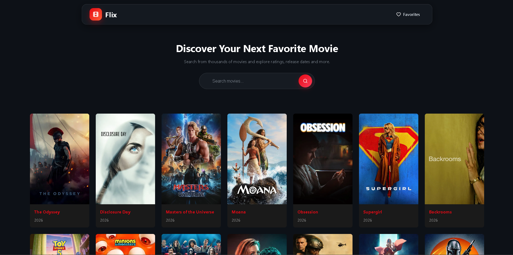
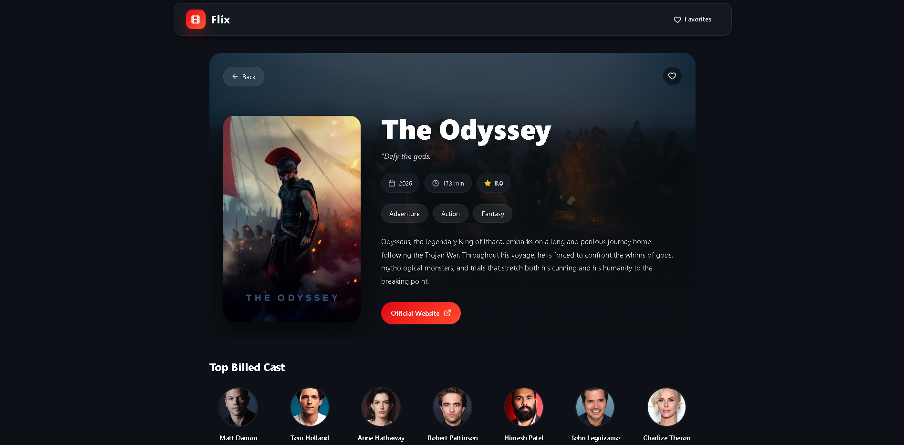
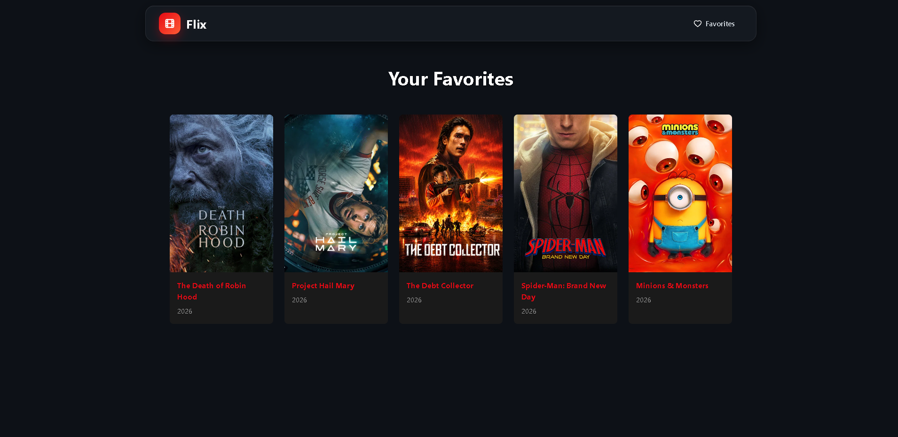

# 🎬 Flix

A modern React movie discovery application built with the **TMDB API**. Browse trending movies, search for your favorite titles, view detailed movie information, and build your own favorites collection with a sleek dark-themed interface.


---

## ✨ Features

- 🔥 Browse popular movies
- 🔍 Search movies instantly
- 🎞️ Detailed movie information
- ⭐ TMDB ratings
- 🎭 Top billed cast
- ❤️ Add & remove favorites
- 💾 Favorites saved in Local Storage
- 🌙 Modern dark UI
- 📱 Fully responsive design
- 🎬 Beautiful movie backdrop hero section
- 🔗 Visit official movie websites
- 👤 Click cast members to search them on Google

---

## 📸 Screenshots


| Home | Movie Details | Favorites |
|------|---------------|-----------|
|  |  |  |

---

## 🚀 Live Demo
https://flix-movie-sepia.vercel.app/

---

## 🛠 Tech Stack

### Frontend

- React
- Vite
- React Router
- Context API
- CSS3
- Lucide React Icons

### API

- The Movie Database (TMDB)

### Storage

- Local Storage

---

## 📂 Project Structure

```text
src
│
├── components
│   ├── MovieCard.jsx
│   └── Navbar.jsx
│
├── contexts
│   └── MovieContext.jsx
│
├── pages
│   ├── Home.jsx
│   ├── Favorites.jsx
│   └── MovieDetails.jsx
│
├── services
│   └── api.js
│
├── css
│   └── App.css
│   └── Favorites.css
│   └── Home.css
│   └── MovieCard.css
│   └── MovieDetails.css
│   └── Navbar.css
│   └── index.css
│
├── App.jsx
└── main.jsx
```

---

## ⚙️ Installation

Clone the repository

```bash
git clone https://github.com/yourusername/flix.git
```

Navigate to the project

```bash
cd flix
```

Install dependencies

```bash
npm install
```

Create a `.env` file

```env
VITE_TMDB_API_KEY=YOUR_API_KEY
```

Start the development server

```bash
npm run dev
```

---

## 🔑 Environment Variables

```env
VITE_BASE_URL = https://api.themoviedb.org/3
VITE_TMDB_API_KEY=YOUR_API_KEY
```

Get your free API key from:

https://developer.themoviedb.org/

---

## 🎯 Future Improvements

- 🎥 Movie trailers
- 📺 TV Shows support
- 👤 Actor details page
- ⭐ User ratings
- 🎬 Similar movies
- 📜 Infinite scrolling
- 🔥 Trending movies
- 🎞️ Movie recommendations
- 🌍 Multi-language support
- 🌗 Light/Dark mode toggle

---

## 📚 What I Learned

While building **Flix**, I gained hands-on experience with:

- React Hooks
- Context API
- React Router
- API Integration
- Local Storage
- Responsive Design
- Component Architecture
- State Management
- Error Handling
- Modern UI Design

---

## 🙌 Acknowledgements

- The Movie Database (TMDB)
- React
- Vite
- Lucide Icons

---

## 📄 License

This project is licensed under the MIT License.

---

## 👨‍💻 Author

**Sarvesh Mondkar**

GitHub: https://github.com/sarveshmondkar

If you found this project helpful, consider giving it a ⭐!
